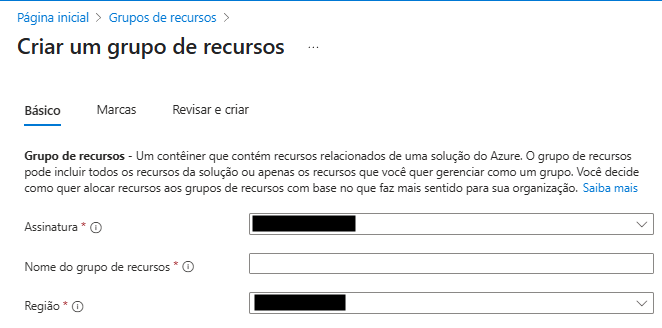
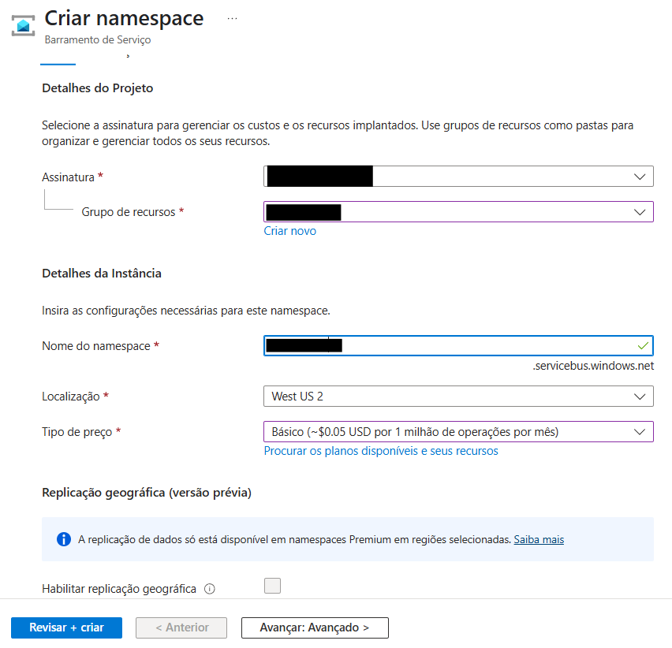
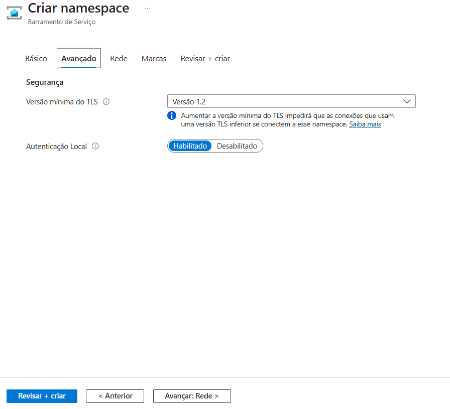
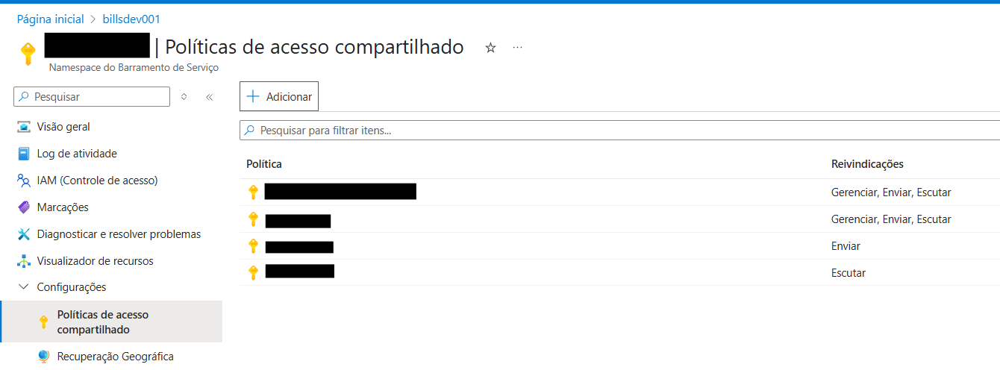
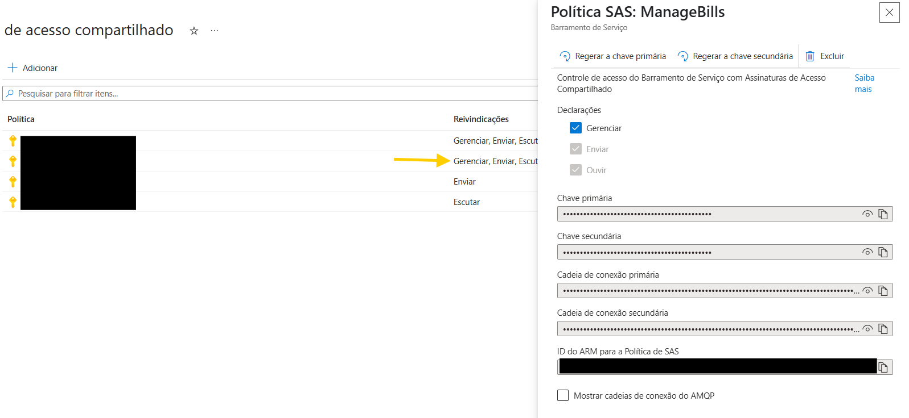
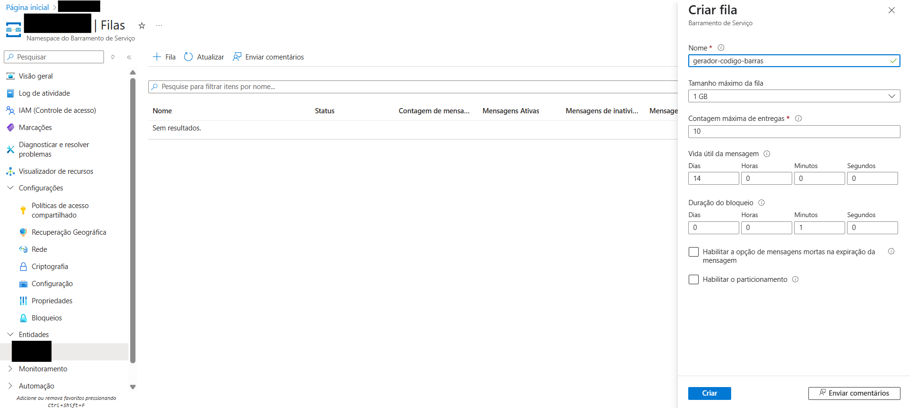
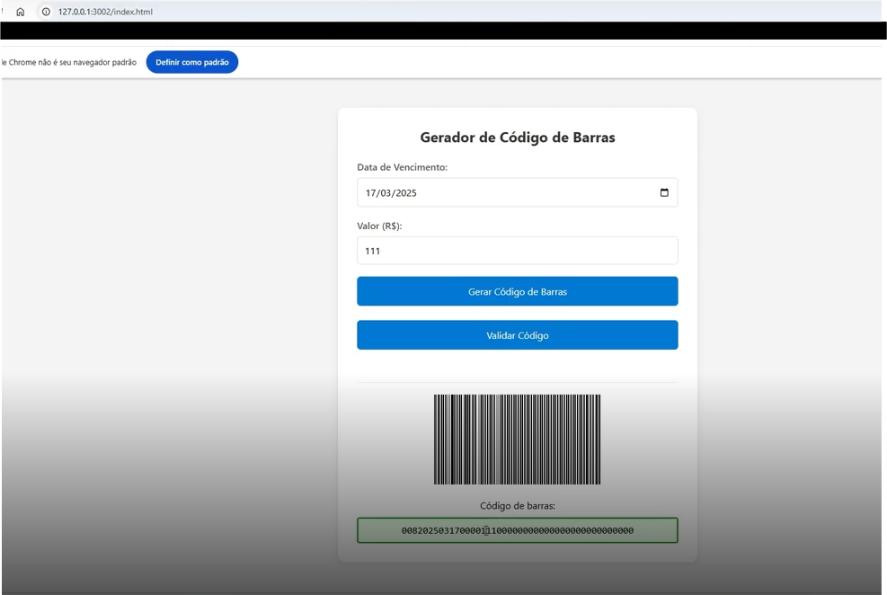

O projeto apresenta a chamada de API para coletar dados, gerando um boleto e outra API que valida os dados. Para isso, utilizamos o Azure Service Bus para enviar e receber mensagens entre as APIs. Abaixo estão as tecnologias utilizadas no projeto:

* C#
* NuGet Packages
* Newtonsoft_json
* BarcodeLib


O presente projeto utiliza uma API em C# para coletar dados, gerar um boleto e validar os dados. Abaixo estão as etapas para configurar e executar o projeto:
## Configuração do Projeto
Para inicializar o projeto, usamos o Visual Studio Code para iniciar o projeto em C#. O projeto em si está contido na pasta fnGeradorBoleto. A API usa o Newtonsoft_json e BarcodeLib para criação dos códigos de barras. 
Na azure iremos criar uma service bus para receber as mensagens. Usaremos o Azure Service Bus. Primeiramente, crie um namespace e, pesquisando pelo mesmo, selecione sua assinatura e escolha sua região e aperte avançar.

Depois, selecione o grupo de recurso e insira um nome de namespace. após isto aperte avançar.

Após isto, selecione a versão minima do TLS para 1.2 e aperte revisar e criar.

Após isto, selecione configurações > políticas de acesso compapartilhado. Como boa prática, crie um serviço para cada ação.

Adicione a informação no arquivo local.settings.json, conforme abaixo:
```json
{
        "IsEncrypted": false,
    "Values": {
        "AzureWebJobsStorage": "UseDevelopmentStorage=true",
        "FUNCTIONS_WORKER_RUNTIME": "dotnet-isolated",
        "ServiceBusConnectionString": "Endpoint=sb:<nome-de-politica>;SharedAccessKey"
    }
}
```
Para encontrar o nome de política, vá em "Access Policies" e copie o valor de "Cadeia de conxão primária". Este valor deve ser adicionado ao arquivo local.settings.json como mostrado acima.

Após criado o local.service.json, crie uma fila. A fila é onde as mensagens serão enviadas e recebidas. Clique em "Queues" e, em seguida, em "Add Queue".Vá em entidades > criar fila. Coloque o nome da fila para gerador-codigo-barras e aperte criar.

Uma vez criada a fila, será utilizada tanto para enviar os boletos quanto para validar. A função fnValidaBoleto irá verificar no frontend localizado em Front se o boleto foi validado ou não.
## Executando o Projeto
Para executar o projeto, aperte F5 em Front e verifique se está disponível na porta 3002 em [localhost](http://localhost:3002).

